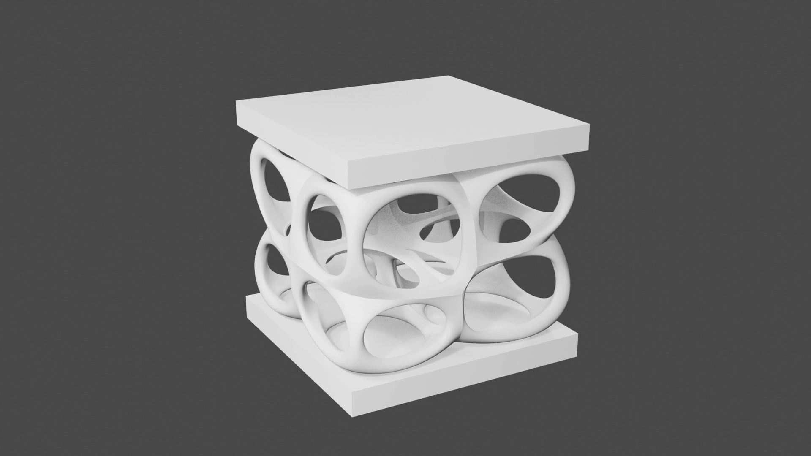
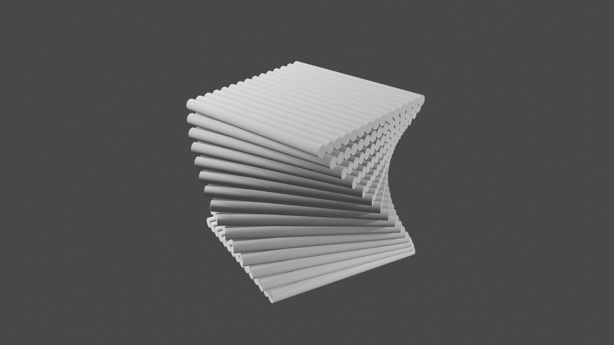
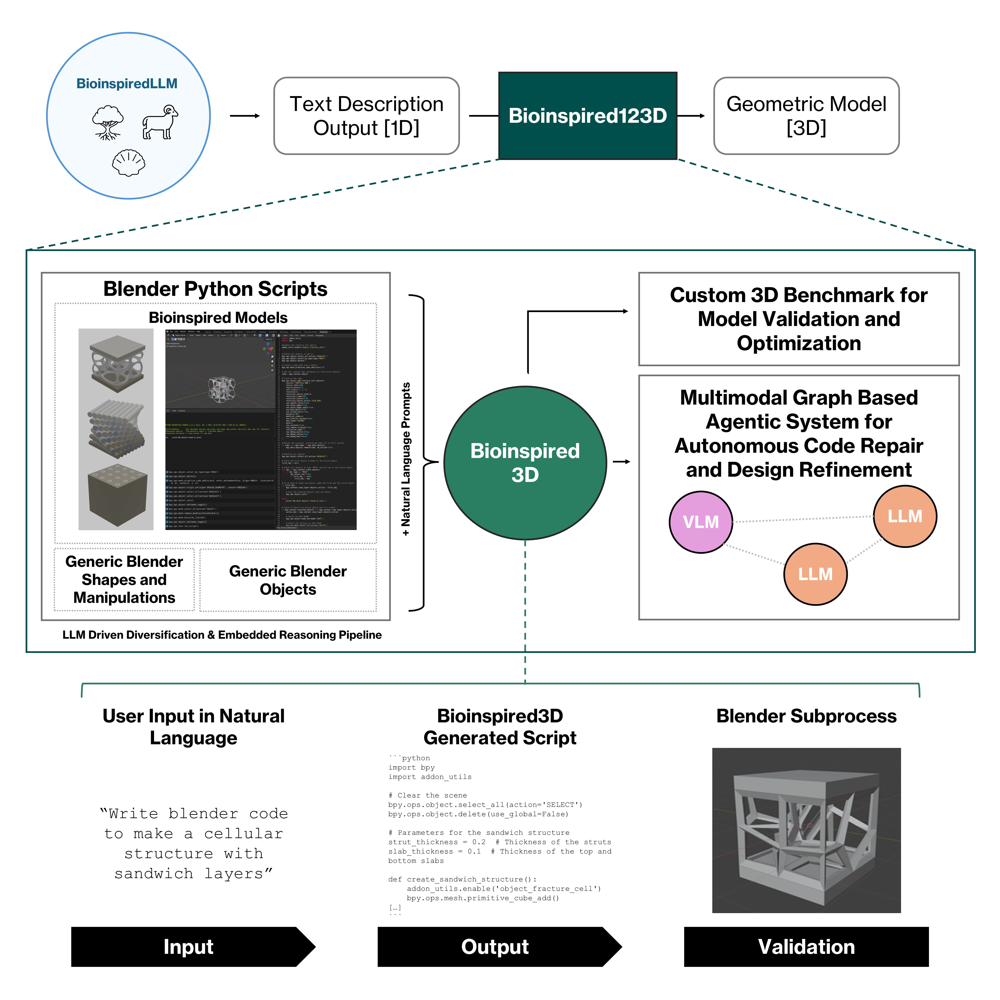
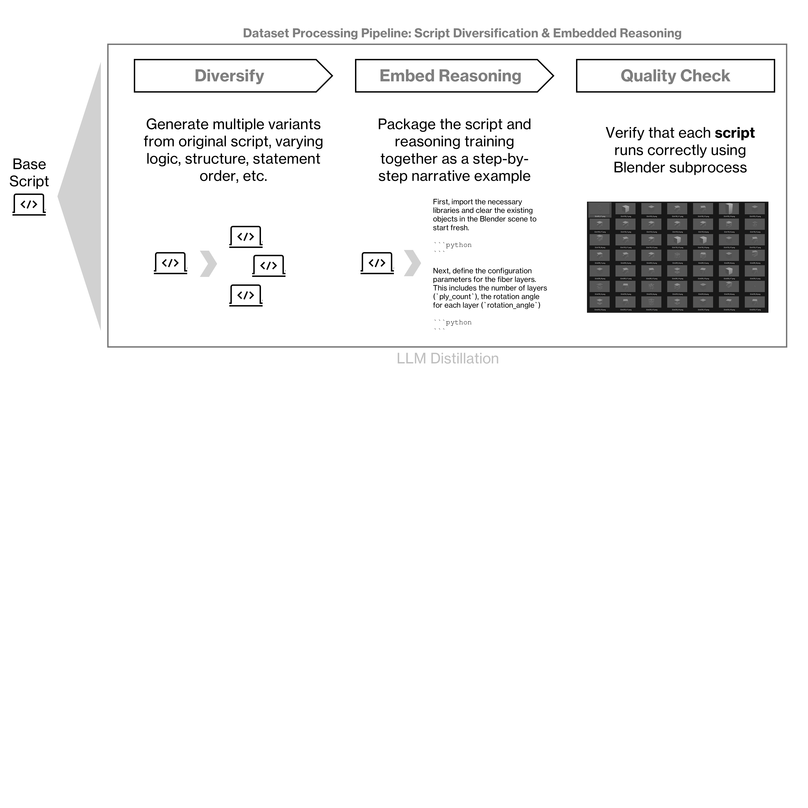

# Bioinspired123D
**Generative 3D Modeling System for Bioinspired Structures**

**Authors:** Rachel K. Luu, Markus J. Buehler (2026)  
**Corresponding author:** mbuehler@mit.edu

---

## Overview

**Bioinspired123D** is a generative agentic framework that translates natural language descriptions of biological structure into executable **Blender Python scripts**, producing 3D bioinspired geometries.

The system explores how lightweight, finetuned LLMs extend beyond 1D text generation to structured **3D model synthesis**, enabling exploration of tubular, helical, cellular, and hybrid architectures inspired by biological materials.

Core ideas:
- Language → executable geometry  
- Procedural 3D generation via Blender scripting  
- Multimodal grounding using rendered images and code validation  
- Agentic and staged inference for robustness and repair  
- Compact models designed for limited compute settings  

https://github.com/user-attachments/assets/1e969fb3-2801-411e-a992-0070c127a4d4

<p align="center">
  <a href="https://github.com/user-attachments/assets/1e969fb3-2801-411e-a992-0070c127a4d4">
    
  </a>
  <a href="https://github.com/user-attachments/assets/d98986da-8927-4dfe-bb80-f9d941ca1ad6">
    
  </a>
  <a href="https://github.com/user-attachments/assets/c7638f30-5564-4669-b28f-684628729558">
    
  </a>
</p>




## Repository Structure

```text
├── data/
│   ├── bioinspired3d_dataset_final.csv   # Final dataset used to fine tune Bioinspired3D
│   ├── raw/                              # Base Blender codes or selected BlendNet dataset
│   └── rag/                              # JSONLs and renders used for RAG with LLMs and VLMs
├── notebooks/
│   ├── scripts/
│   ├── 00_dataset_pipeline.ipynb         # Dataset generation and diversification pipeline
│   ├── 01_inf_Bioinspired3D.ipynb        # Inference using the fine tuned Bioinspired3D model
│   └── 02_inf_Bioinspired123D.ipynb      # Full agentic system for 3D structure generation
├── training/
│   └── finetune_bio3d.py                 # Training script for Bioinspired3D
├── eval/
│   ├── benchmark_eval.py
│   ├── benchmark_eval_wRAG.py
│   └── benchmark.csv
├── requirements.txt
└── README.md
```
## Setup

### 1. Clone the repository
```bash
git clone https://github.com/lamm-mit/bioinspired3d.git
cd bioinspired3d
```
### 2. Create and activate a virtual environment
```bash
python3 -m venv venv
source venv/bin/activate
pip install -r requirements.txt
```
### 3. Install Blender 
Blender is required for script execution and render based validation.
Download Blender 4.2.1 or newer from
https://www.blender.org/download/
Install the Cell Fracture extension for cellular structures
https://extensions.blender.org/add-ons/cell-fracture/

## Using the Notebooks
**Recommended order:**

### 00_dataset_pipeline.ipynb
Generates a Blender code dataset from natural language prompts using diversification and embedded reasoning.



### 01_inf_Bioinspired3D.ipynb
Runs inference with **Bioinspired3D**, the fine tuned LLM that generates Blender Python scripts directly from prompts.

### 02_inf_Bioinspired123D.ipynb
Runs the full **Bioinspired123D** agentic system, including retrieval, validation, and repair, using either user prompts or prompts generated by BioinspiredLLM.

Each notebook is self contained and documented.


## Training
We release the training code used to fine tune **Bioinspired3D**.  
A Hugging Face token is required.
```bash
python training/finetune_bio3d.py
```


## Evaluation
We also release evaluation scripts for benchmarking **Bioinspired3D**.
A Hugging Face token is required.
```bash
python eval/benchmark_eval.py --models <path_to_model_checkpoints>
```
With retrieval augmented generation:
```bash
python eval/benchmark_eval_wRAG.py --models <path_to_model_checkpoints>
```

## Citation 
If you use this work, please cite:
```bibtex
@article{luu2026bioinspired123d,
  title={Bioinspired123D: Generative 3D Modeling System for Bioinspired Structures},
  author={Luu, Rachel K. and  Buehler, Markus J.},
  year={2026}
}
```

